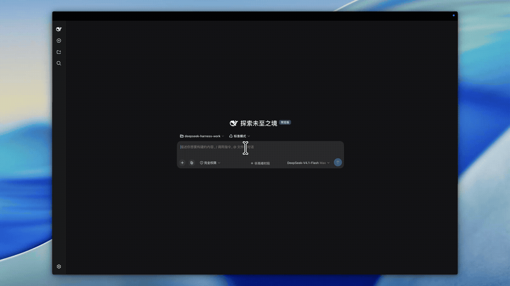

# dsh-header-balance

[English](./README.en.md) | 中文

**DSH Web GUI 的 DeepSeek 余额芯片**：在会话页头部显示账户余额，点击跳转充值，悬停可见赠送 / 充值拆分。

API Key 与网络请求**全部在宿主侧完成**，key 永不进入浏览器代码。

[](./docs/demo.mp4)

---

## 功能

| 能力 | 说明 |
|---|---|
| 余额显示 | 会话页头部芯片，只显总余额，视觉密度与你熟悉的「会话日志」按钮一致 |
| 点击充值 | 点整块芯片打开 `platform.deepseek.com/top_up`；Electron 外壳会交给系统浏览器 |
| 手动刷新 | 芯片内的 `↻` 按钮（已阻止冒泡，不会误触充值跳转） |
| 自动刷新 | 挂载时、每 60 秒、窗口重新获得焦点时 |
| 悬停详情 | 账户余额 + 赠送 / 充值拆分（赠金为 0 时自动省略该行）+ 充值入口 |
| 窄屏适配 | 手机端省略「余额」二字，只留金额 |
| 不可用告警 | `is_available` 为 false 时给出明确提示，而非静默显示 ¥0.00 |
| 失败可读 | 未配置 Key / Key 失效 / 余额不足 / 限流 / 超时 / 断网 / 响应异常，各有对应文案 |

## 安装

```sh
dsh plugin --profile web add dsh-header-balance
```

重启 DSH 后，会话页头部就会出现余额芯片。

`dsh plugin add` 会读取本包 `package.json` 里的 `dsh.bundle.patch`，**自动**把插件插进配置树，不需要手工编辑 `cordis.patch.yml`。下面是它替你做的事，仅供排查时参考：

```yaml
- insert:
    - id: dsh-header-balance
      name: 'dsh-header-balance'
```

也可以用 npm 直接装（例如自建 profile 或离线分发），但要自己补上面那条 insert：

```sh
npm install dsh-header-balance
```

插件读取的凭据与官方 `llm-deepseek` 适配器**同一个引用**（默认 `DEEPSEEK_API_KEY`），因此只要模型能用，余额就能查到，无需单独配置。

## 架构要点（为什么有宿主侧代码）

「余额」和纯前端的挂件不同，它必须走宿主侧：

```
浏览器（lib/client.js）                 宿主（lib/index.js）
  connection.rpc.call('/api',             读 settings['llm-deepseek']
    'accountBalance/balance', {} )   →    经 credentials.resolve() 取 API Key
        ↓                                   GET api.deepseek.com/user/balance
  只拿到归一化后的数字  ←──────────────      解析线上 snake_case 字符串为数字
```

三条硬约束，都写在 `ARCHITECTURE.md` 里并有行号依据：

1. **客户端不得使用 `ctx.remote.accountBalance`。** `remote.<ns>` 命名空间只为官方那 15 个 strict 贡献挂载；社区插件用了会永久 pending，并把**宿主启动一起拖垮**。必须走原始载体 `connection.rpc.call`。
2. **宿主 `inject` 必须为空。** 它是启动闸门，声明了却拿不到的服务会让整个 App 起不来。`settings` / `credentials` 一律软 `ctx.get()` 读取，取不到就回退。
3. **Remote 方法签名不可随意改。** 网关的 SRC 发现会从 `Function.prototype.toString()` 解析参数名，因此不能用解构、默认值、剩余参数或重名参数。

线上端点：`accountBalance/balance`，载荷 `{ args: {} }`。

## 开发

```sh
node scripts/link-host-deps.mjs   # 把宿主侧 peer 依赖软链到本仓库（仅开发用）
npm run build:bundle              # 由 lib/balance.js 重新生成 bundle 的内联段
npm run check                     # 语法预检 + 校验内联段与源文件一致
npm test                          # 36 项测试
npm run verify                    # 以上全部
```

`lib/client.js` 里的展示逻辑不是手写的，而是由 `scripts/inline-balance.mjs` 从 `lib/balance.js` **构建期内联**。原因是 DSH 的 bundle 解析器只认平台 seed 字面量与已注册的包 id，`require` 自身子路径必定失败；而逻辑又不能直接手写在 bundle 里，否则无法在 Node 下单测。

### 三层测试

- `test/balance.test.js`（12 项）—— 展示格式化与文案。纯函数，无依赖。
- `test/host-service.test.js`（19 项）—— 宿主半边。**真的 import `@deepseek-ai/dsh-typert-protocol`** 并断言 `remoteMethods()` 能读到 Remote 标记，因此 SRC 发现那条路是真验过的，不是打桩。覆盖成功路径、七类失败、凭据优先级与回退、以及「API Key 绝不进入返回值」。
- `test/client-contract.test.js`（5 项）—— bundle 契约。在 `node:vm` 里真正执行 `lib/client.js`，其 require 模拟**只放行平台 seed 字面量**，比真实宿主更严格。

宿主侧测试需要 `scripts/link-host-deps.mjs` 建好软链；缺少已安装的 DSH 时这些用例会**自动跳过**并在报告里标注，纯逻辑测试不受影响。

## 已知边界

- **只在 DSH 0.1.5 的槽位契约上验证过**（`conversation.session.header.utilities`，`kind: list`）。
- **赠送 / 充值拆分只在悬停说明里**，芯片本体只显总额——这是刻意的，避免头部控件变宽。
- **不做余额历史、不做用量统计、不做告警阈值**。
- **金额不参与任何计算**，只做展示格式化；结算发生在服务端。
- 依赖宿主侧的 `settings` 与 `credentials` 服务；两者任一缺失时会回退到进程环境变量，都取不到则提示未配置。

## 许可

MIT
